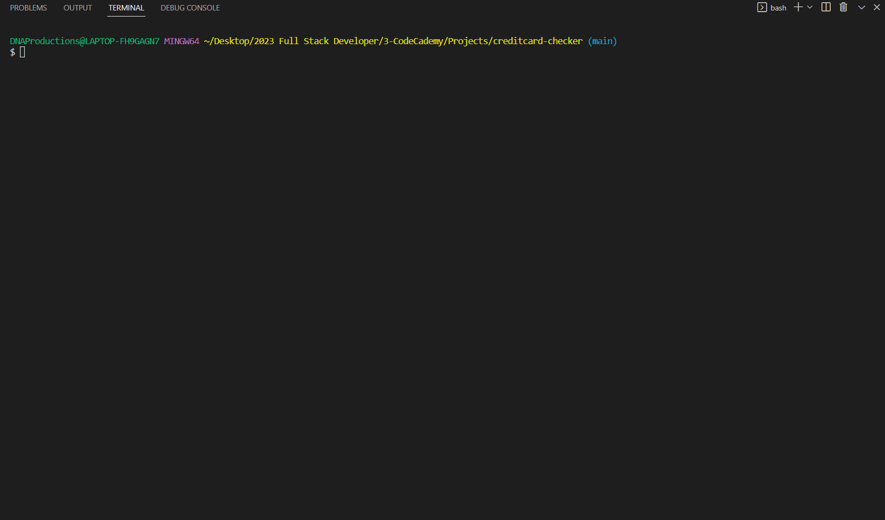

# Challenge Project: Credit Card Checker
Using JavaScript to validate credit card numbers

## Code Demo
<kbd></kbd>

## Instructions
* must have Node.js installed
* through terminal enter:
    * `node main.js` to run application

## Features
* complete code for main functions:
    * validateCred(`credNumArr`)
    * findInvalidCards(`credNumArrBatch`)
    * idInvalidCardCompanies(`invalidCredNumArrBatch`)
* complete code for extended functions:
    * convertToArr(`credNumStr`);
    * convertToValid(`invalidCredNumStr`);
* functions tested and passed